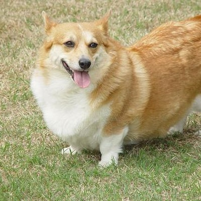

# Credal Datasets

## Presentation

Most datasets used for classification use hard labels. These Credal datasets were labeled uncertainly and imprecisely by contributors during crowdsourcing campaigns. Resulting in richer labels, modeled with the theory of belief funtions, which generalizes several reasoning frameworks with uncertainty, such as  possibilities or fuzzy approaches or even classical probabilites. These datasets can be used with classical models using hard labels but also with probabilistic, fuzzy or even evidential models.
 
## Reference

When using one of those datasets please cite :  
C. Thierry, A. Hoarau, A. Martin, J.-C. Dubois, Y. Le Gall, Real bird
dataset with imprecise and uncertain values, in: *7th International Con-
ference on Belief Functions*, 2022.

## Interface

The following interface was used during crowdsourcing campaigns:


## Description

### Summary


| Dataset     | Classes     | Observations  | Features |  
| :---        |    :----:   |         :---: | :---:   |  
| Credal Dog-7      | 7       | 700   | 43 |  
| Credal Dog-4      | 4       | 400   | 47 |  
| Credal Dog-2      | 2       | 200   | 42 |  
| Credal Bird-10    | 10      | 200   | 30 |  
| Credal Bird-2     | 2       | 40    | 17 |  

### Architecture

Each dataset has its own directory:

```bash
Repository
├── Credal Dog-7
├── Credal Dog-4
├── Credal Dog-2
├── Credal Bird-10
└── Credal Dog-2
```

Within a dataset, you can find the dataset itself in *data* and additional resources in *extra* :

```bash
Credal dataset
├── data
│   ├── classes.csv: Classes of the dataset
│   ├── X.csv: Features of the dataset
│   ├── X_512.csv: Learge 512 features vector of the dataset
│   ├── X_pictures.csv: Rawn features (The picture itself)
│   ├── y.csv: Rich labels
│   └── y_true.csv: True labels
└──  extra
    ├── y_hard.csv: Hard labels given during a new campaign
    ├── DATA_imperfect.csv: Imperfect answers given during the campaign
    ├── ITERATION_imperfect.csv: Imperfect 2nd step answers given during the campaign
    ├── EVENT_imperfect.csv: Contributors events
    ├── ID_imperfect.csv: Contributors IDs
    └── DATA_perfect.csv: Precise answers given during a new campaign
```

### Access to pictures
You can access all the pictures and decide to use them as observations by following this link : [Credal Datasets Pictures](https://www.dropbox.com/sh/fwc4xf09ti12dt3/AADJNlncG6b3Z_3jdiVUsnTha?dl=0)  
Refer to data/X_pictures.csv to know which picture corresponds to which observation.

## Credal Dog-7

Welsh Corgi | Collie | Shetland Sheepdog | Foxhound | Basset | Brittany | Beagle
:--:|:--:|:--:|:--:|:--:|:--:|:--:
 |  |  |  |  |  |    


## Credal Dog-4

Foxhound | Basset | Brittany | Beagle
:--:|:--:|:--:|:--:
 |  |  |    


## Credal Dog-2

Brittany | Beagle
:--:|:--:
 |    


## Credal Bird-10

Carrion Crow | Common Raven | Rook | Western Jackdaw | European Robin
:--:|:--:|:--:|:--:|:--:
 |  |  |  |   

Coal Tit| Great Tit | Marsh Tit | Common Wood Pigeon | Rock Dove
:--:|:--:|:--:|:--:|:--:
 |  |  |  |   


## Credal Bird-2

Western Jackdaw | Rook
:--:|:--:
 | 


## Acknowledgement

Pictures of Credal Dog datasets are for the majority resized from ImageNet as well as some personal imports. It is greatly ispired by Stanford Dogs datasets. For Credal Bird datasets, some of the pictures are from us, but we would also like to thank the contributors of Pixabay and Wikimedia, all aliases are listed here.

### References

J. Deng, W. Dong, R. Socher, L.-J. Li, K. Li, and L. Fei-Fei, “Imagenet: A large-scale hierarchical image database,” in *2009 IEEE Conference on Computer Vision and Pattern Recognition*, 2022.

A. Khosla, N. Jayadevaprakash, B. Yao, and L. Fei-Fei, “Novel dataset for  fine-grained  image  categorization,”  in *First  Workshop  on  Fine-Grained  Visual  Categorization, IEEE Conference on Computer Vision and Pattern Recognition*, June 2011.

### Aliases

Accipiter, Alexas_Fotos, Alpsdake, Andreas Trepte, Anders_Mejlvang, Antranias, arcaion, artellliii72, balouriarajesh, Ben_Kerckx, blende12, bluebudgie, Brian Snelson, brigitteJ, cadop, Calandrella, Capri23auto, Carola68, Cock-Robin, Crazyhorse50, connie_sf, Daniel Aufgang, DavidReed, DESIGNBYTHOLEN, DickDaniels, Didgeman, Diego Delso, Diliff, Erik_Karits, federicomaderno, Fleuber, Frank Schulenburg, FraukeFeind(ID 127071), Free-Photos, frolicsomepl, Georg_Wietschorke, Hans, Helga Kattinger, hossszu, InspiredImages, ivohouska, JackBulmer, Jacques GAIMARD, Janeenga, JA2020, JillWellington, jLasWilson,jon57, JosepMonter, JStolp, Karsten_madsen, Kathy2408, Kevinsphotos, Loco65, Louis_Parkerson, LubosHouska, Luc Viatour, MabelAmber, manfredrichter, maroj10, Marta Boroń, Matvei Kiselev, menita, Michael Warnock, MikeGoad, MIZIe, mohann, Mopsgesicht, Natalie-S, Nennieinszweidrei, Netti_Nu_Nu, NickyPe, Nicolas Weghaupt, ntrief, obsidianphotography, Oisbat, Oldiefan, Paul_Henri, Pexels, photosbygreendwood, picturism, pierre_rigou, Pkspks, planet_fox, pollydot, Rafał Komorowski, Ralphs_Fotos, rzierik, SandeepHanda, Santa3, sarangib, schauhi, Seaq68, Sébastien FAILLON, simardfrancois, Sławek Staszczuk, Stevebidmead, SteveCrowhurst, susannp4, TheOtherKev, Uschi_Du, valentinhintikka, VasilySukovatitsyn, Vinding, WimdeGraaf, wolfgang_vogt, xulescu_g, YvonneHuijbens, zkrej, Zoovolunteer1961, 165106, 2204574, 850977.
        

